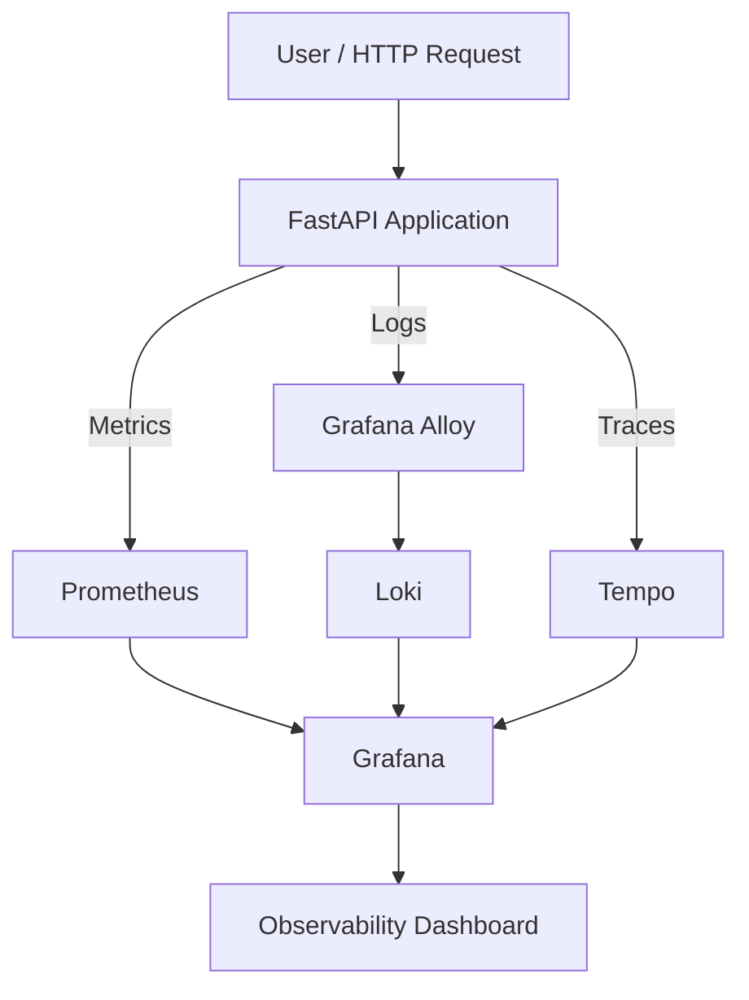

# Observability System Architecture

```mermaid
flowchart TD
    U[User / HTTP Request] --> APP[FastAPI Application]
    APP -->|Metrics| PROM[Prometheus]
    PROM --> GRAF[Grafana]
    APP -->|Logs| ALLOY[Grafana Alloy]
    ALLOY --> LOKI[Loki]
    LOKI --> GRAF
    APP -->|Traces| TEMPO[Tempo]
    TEMPO --> GRAF
    GRAF --> DASH[Observability Dashboard]
```

